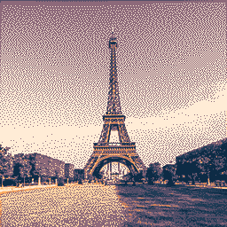
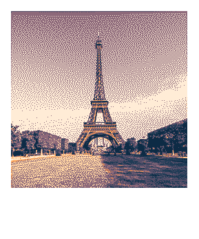

# Polaroidify

A program that converts an image into a "Polaroidified" image, with white borders around the edges proportional to polaroid sizing.

| Original | Polaroid |
| :-: | :-: |
|  |  |

## Usage

Use the `polaroidify` command followed by the input and output flags.

## CLI
`polaroidify [options]`
| Flag | Description | Necessity |
| :-- | :-- | :-- |
| `-h, --help` | Displays help | Optional |
| `-i, --input <FILE_PATH>` | Specifies the input png image file path | Required |
| `-o, --output <FILE_PATH>` | Specifies the file path the output png will be saved to | Required |

## Example
The example below is executed from the root directory. `polaroidify` can be used instead of `.\bin\polaroidify.exe` if the executable is added to your path. Input and output directories are shown relative to the root directory, but absolute paths can be used as well.</br>
`.\bin\polaroidify.exe -i .\input\eiffel_tower.png -o .\output\eiffel_tower_polaroid.png`</br>

## To Compile
Requirements: GNU C++ compiler, make<br/>
Open a terminal in the root directory and enter the command
```bash
> make
```
